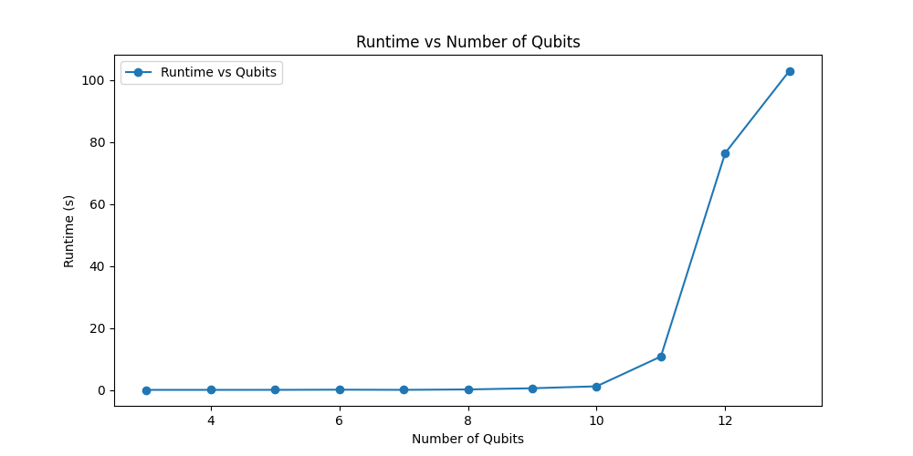
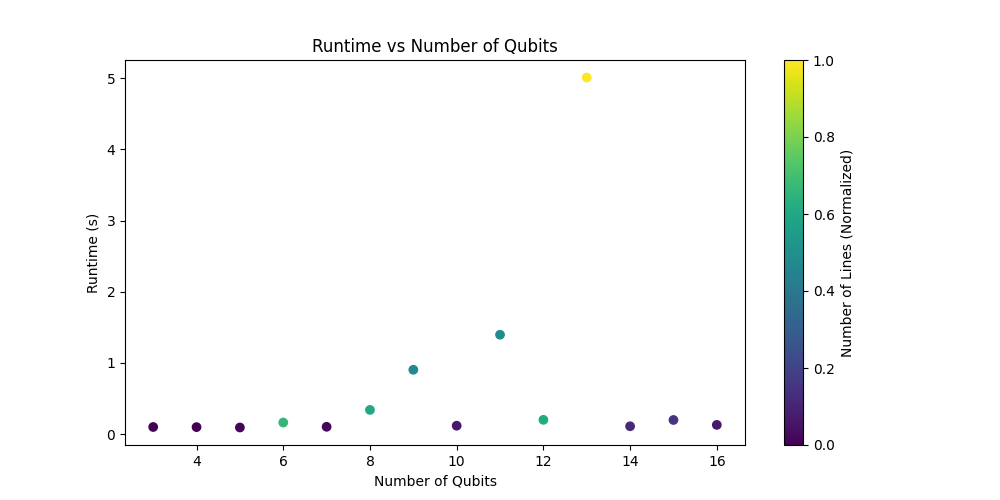

# Quantum Circuit Simulator

## Overview

This repository contains my personal simulator for a quantum circuit capable of handling systems with up to 16 qubits. 
The simulator supports two simulation models:

1. **Matrix Representation:** Optimal for up to 10 qubits.
2. **Ket Representation:** Efficiently tested up to 16 qubits.

## Features

- **Supported Gates:** Includes X, H, T, Tdg, and CX gates.
- **QASM File Input:** Simulates quantum circuits defined in QASM files.
- **Output:** Outputs the final states of the quantum system post-simulation.
- **Easy Mode Switching:** (In Development) Implementing a feature to easily switch between Matrix and Ket representations.
- **Measurements:** (In Development) Working on incorporating quantum measurements.

## Results
Additionally, you can run the `test.py` script to execute a series of algorithms. This script also plots the runtime in relation to the number of qubits and lines, providing valuable insights into the simulator's performance.
The algorithms tested for these results are located in the `algorithms` folder. They have varying numbers of qubits and gates, which is why a color gradient is used to represent the number of gates.

**Note:** The matrix representation circuit in this simulator can handle systems up to 13 qubits. Beyond this, the program may crash due to excessive memory usage.

### Quantum Simulation: Matrix Representation



### Quantum Simulation: Ket Representation



## Future Work

More optimization is needed and libraries like Pyzx can be used for this purpose.

## Usage

To run the simulator, use the following command:

```bash
python simulator.py "filename.qasm"
```
```bash
python test.py "output_filename"
```


